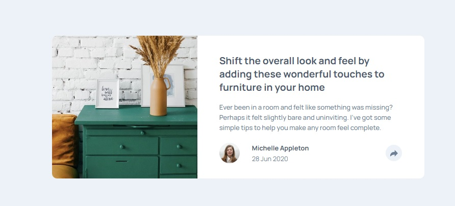

# Frontend Mentor - Article preview component solution

This is a solution to the [Article preview component challenge on Frontend Mentor](https://www.frontendmentor.io/challenges/article-preview-component-dYBN_pYFT). 

## Table of contents

- [Overview](#overview)
  - [The challenge](#the-challenge)
  - [Screenshot](#screenshot)
  - [Links](#links)
- [My process](#my-process)
  - [Built with](#built-with)
  - [What I learned](#what-i-learned)
- [Author](#author)

## Overview

### The challenge

Users should be able to:

- View the optimal layout for the component depending on their device's screen size
- See the social media share links when they click the share icon

### Screenshot

### Links

- Solution URL: [GitHub](https://github.com/Pablo-Zallio-Dev/component_preview)
- Live Site URL: [Netlify](https://component-preview.netlify.app/)

## My process

### Built with

- Semantic HTML5 markup
- CSS custom properties
- Flexbox
- Mobile-first workflow
- JavaScript Vanilla

### What I learned

I learned to organize myself in the layout before starting the code so that later everything will be easier.

## Author

- Linkedin - [Pablo Zallio](https://www.linkedin.com/in/pablo-damian-zallio-zabala-140b83278/)
- GitHub - [Pablo-Zallio-Dev](https://github.com/Pablo-Zallio-Dev)
- Frontend Mentor - [@Pablo-Zallop-Dev](https://www.frontendmentor.io/profile/Pablo-Zallio-Dev)